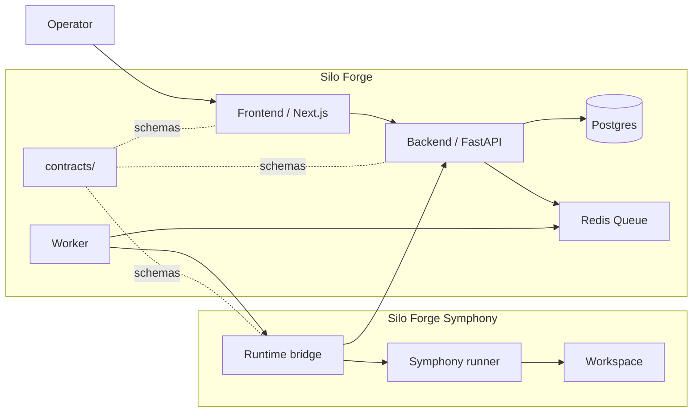
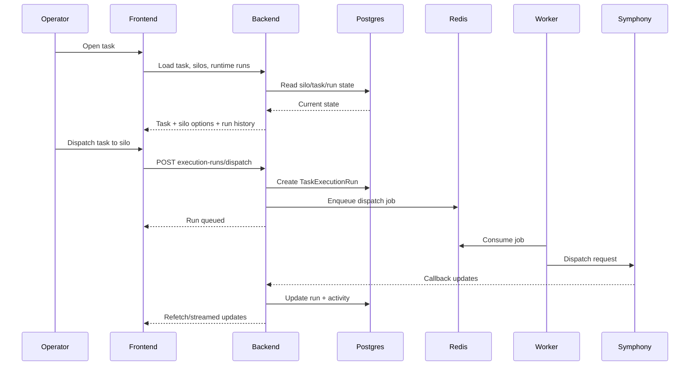
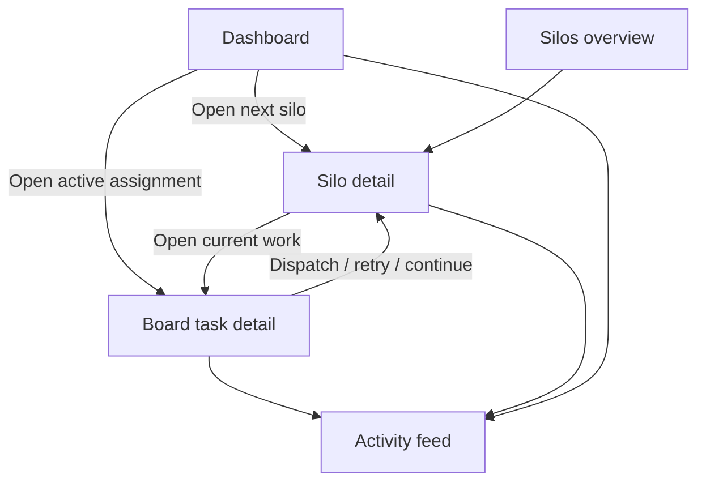
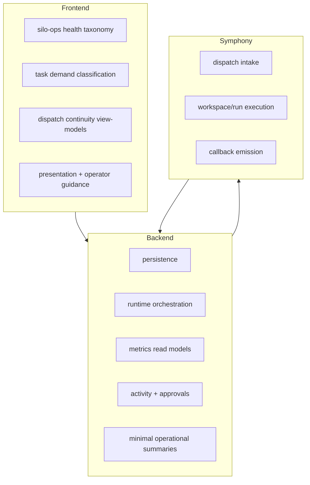

# System Overview

This page gives a visual, operator-first view of how Silo Forge is structured.

## 1. Product topology

## 2. Core runtime flow

## 3. Core operator surfaces

## 4. Responsibility split

## 5. What is core vs secondary

### Core UX

- create and configure silos
- inspect silo health and workload
- assign task work to the right silo
- continue or retry on the current silo
- intervene on blocked, failed, or approval-gated runs

### Secondary UX

- silo requests and planning queues
- future capacity planning
- richer recommendation explanation such as switching-cost scoring

## Notes

- `silo-forge` is the control plane and product center.
- `silo-forge-symphony` is the execution runtime integration layer.
- `contracts/` is the source-of-truth for cross-service boundaries.
- The product is intentionally moving toward `silo operations first`, not planning-first.
