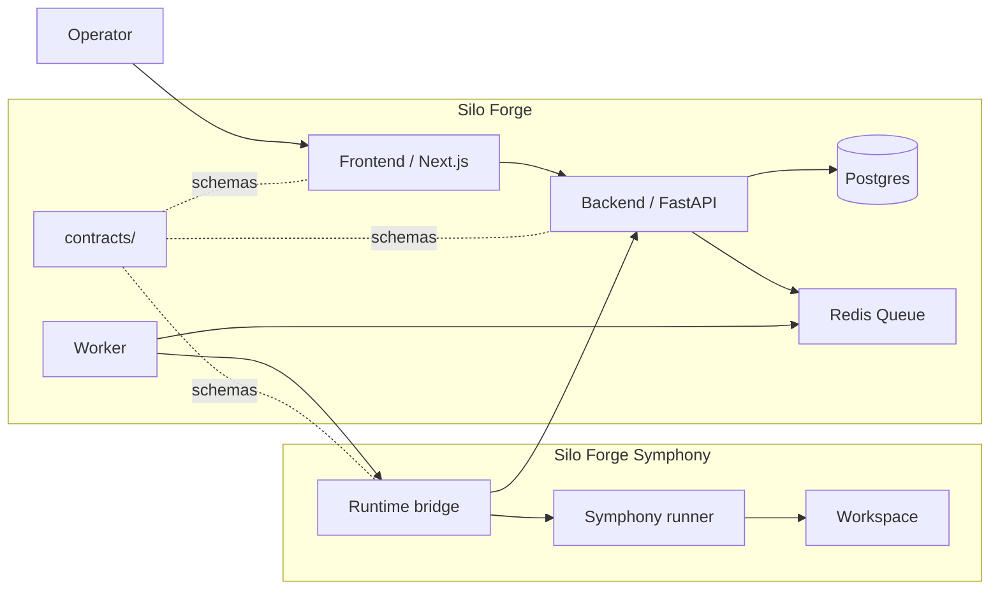
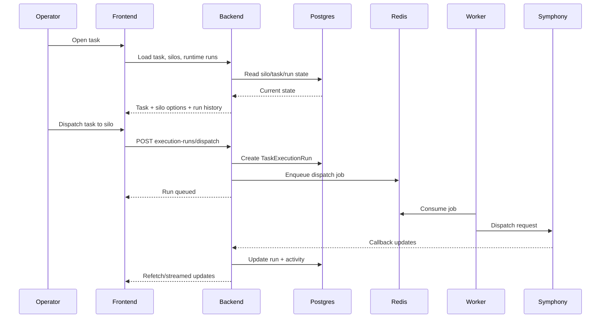
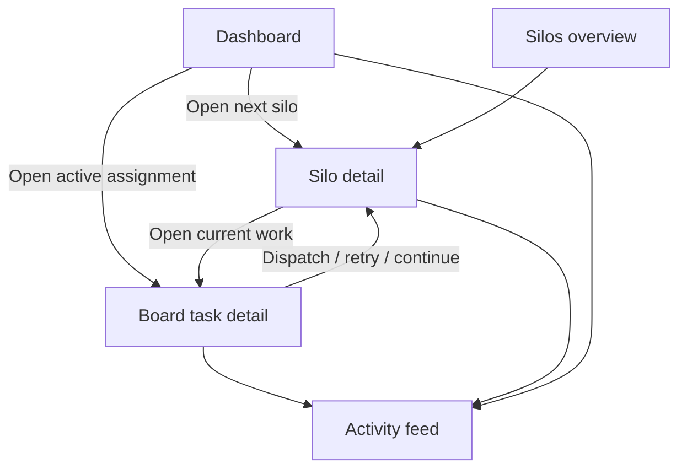
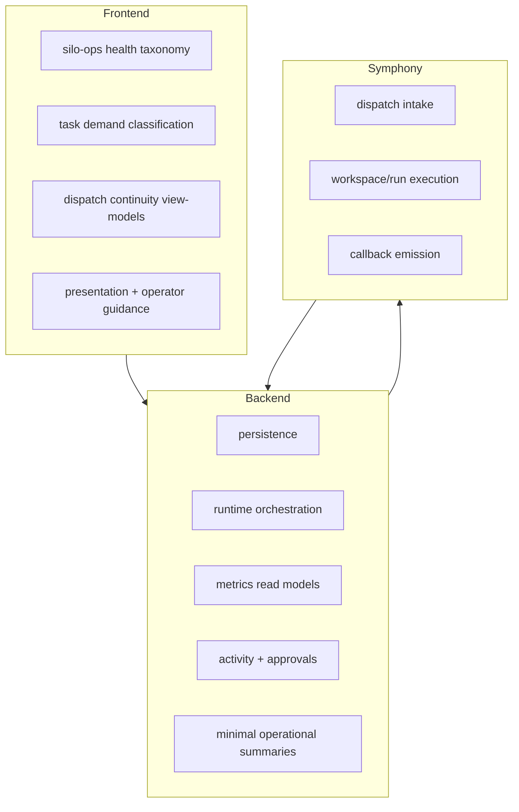
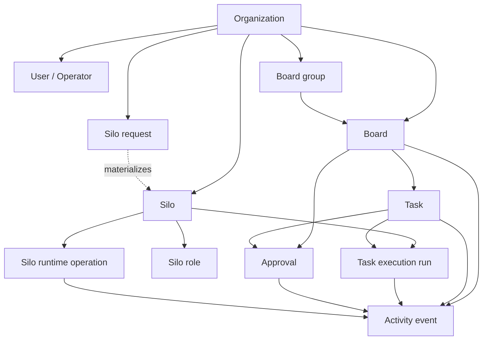
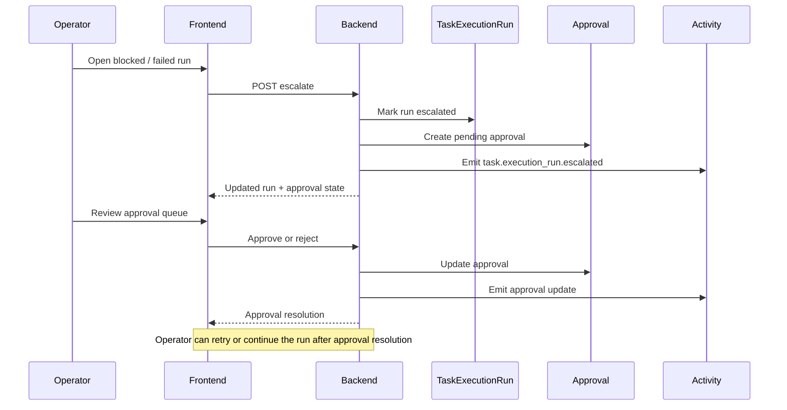
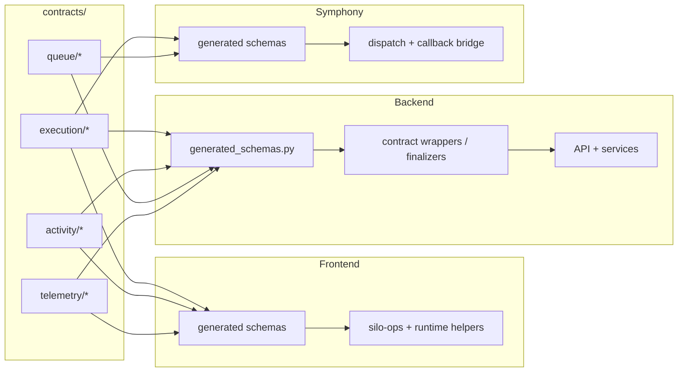
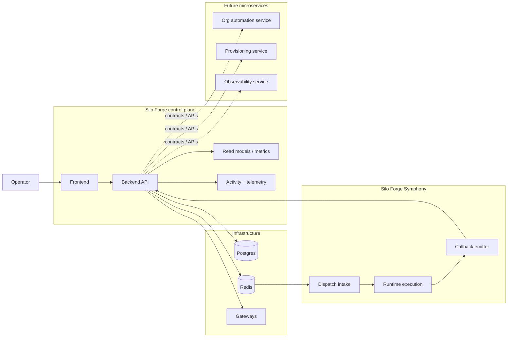

# System Overview

This page gives a visual, operator-first view of how Silo Forge is structured.

## 1. Product topology

## 2. Core runtime flow

## 3. Core operator surfaces

## 4. Responsibility split

## 5. What is core vs secondary

### Core UX

- create and configure silos
- inspect silo health and workload
- assign task work to the right silo
- continue or retry on the current silo
- intervene on blocked, failed, or approval-gated runs

### Secondary UX

- silo requests and planning queues
- future capacity planning
- richer recommendation explanation such as switching-cost scoring

## 6. Domain model

### Reading the model

- `Silo` is the main operating unit.
- `TaskExecutionRun` is the runtime attempt that joins a task to a silo.
- `SiloRequest` is secondary planning state that can materialize into a silo later.
- `ActivityEvent` is the explainability layer that records what happened across the product.

## 7. Approval and escalation flow

### Why this matters

- escalation is not an isolated runtime action
- it creates governance state
- governance state flows back into runtime guidance on the dashboard, task detail, and silo detail

## 8. Contract boundary map

### Boundary rule

- schemas live in one place: `contracts/`
- each service consumes generated artifacts locally
- services do not import each other's runtime code directly

## 9. Multi-service integration map

### Integration direction

- Silo Forge remains the product center and operator surface.
- runtime systems and future microservices should connect through explicit contracts and APIs.
- new services should not fork the core state vocabulary independently.

## Notes

- `silo-forge` is the control plane and product center.
- `silo-forge-symphony` is the execution runtime integration layer.
- `contracts/` is the source-of-truth for cross-service boundaries.
- The product is intentionally moving toward `silo operations first`, not planning-first.
